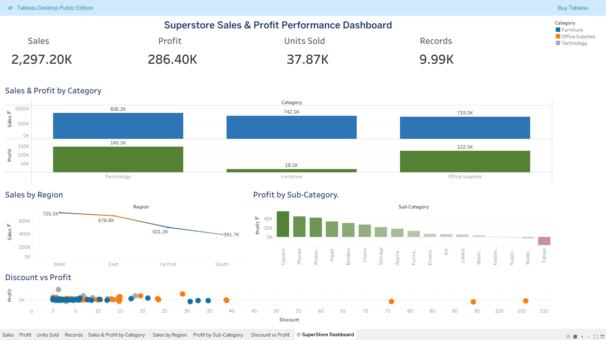

# Retail Sales Analysis Dashboard

## Overview

Analyzed 9,994 retail sales transactions using MySQL and developed an interactive Tableau dashboard to evaluate sales performance, profitability, customer segments, and regional trends.

## Tools

* MySQL
* Tableau
* Microsoft Excel

## Live Dashboard

🔗 Tableau Public Dashboard: [View Dashboard](https://public.tableau.com/app/profile/ashwin.r4543/viz/SuperstoreSalesDashboard_17817724302500/SuperStoreDashboard)

## Dataset

* Sample Superstore Dataset
* 9,994 Records

## SQL Analysis

Performed business analysis using SQL, including:

* Total Sales, Profit, and Quantity Sold
* Sales by Region, Category, and Segment
* Region-wise Profit Comparison
* Top 10 Cities by Sales
* Bottom 10 Cities by Profit
* Cities with Negative Profit
* Top 10 Sub-Categories by Sales
* Sub-Categories with Negative Profit
* Discount vs Profit Analysis

## Dashboard Features

### KPIs

* Total Sales
* Total Profit
* Units Sold
* Total Records

### Visualizations

* Sales by Category
* Profit by Region
* Top 10 Cities by Sales
* Bottom 10 Cities by Profit
* Discount vs Profit Scatter Plot

### Filters

* Region
* Category
* Segment

## Key Insights

* Technology generated the highest sales.
* Profitability varied significantly across regions.
* Several cities and sub-categories operated at a loss.
* Higher discounts were associated with lower profitability.

## Dashboard Preview

## Project Structure

Retail-Sales-Analysis/
├── Dataset/
├── SQL/
├── Tableau/
├── Images/
└── README.md

## Author

Ashwin
